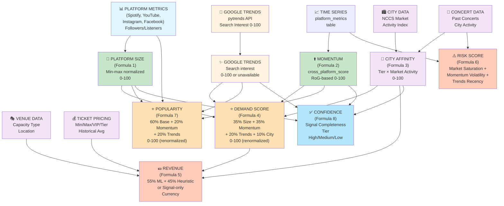

# ARTIST METRICS — ANALYTICS FORMULA FLOWCHART FOR EXTERNAL AUDIT

**Project:** ArtistDashboard (MAD — Music Artist Dashboard)  
**Date:** 2026-09-02  
**Purpose:** Complete technical audit trail for external reviewer to trace any score back to raw inputs and transformations

---

## TABLE OF CONTENTS

1. [Executive Summary](#executive-summary)
2. [Master Architecture & Dependencies](#master-architecture--dependencies)
3. [Formula Pages](#formula-pages)
   - Page 1: Master Flow
   - Page 2: Popularity, Momentum, Platform Size
   - Page 3: City Affinity, Demand, Risk, Confidence
   - Page 4: Revenue Engine
   - Page 5: Google Trends & Venue Capacity
4. [Governance & Known Issues](#governance--known-issues)
5. [Verification Commands](#verification-commands)

---

## EXECUTIVE SUMMARY

### What This Flowchart Covers

This audit flowchart documents **all analytics metrics** computed by the ArtistDashboard platform, specifically designed to allow an external auditor to:

1. **Trace any final score** (Popularity, Demand, Revenue, Risk, Confidence) back through its calculation chain to the raw data inputs
2. **Identify formula discrepancies** between documented design and actual implementation
3. **Understand data dependencies** and how missing signals are handled
4. **Verify calculations** using the provided verification commands

### Key Architectural Warning ⚠️

**The project contains THREE independent analytics "brains" that sometimes compute the SAME metrics with DIFFERENT formulas:**

| Brain | Location | Primary Output | Status |
|-------|----------|-----------------|--------|
| **Viberate Pipeline** | `backend/src/services/scrapers/viberate/` | ArtistPopularityV2 (v2.1-viberate) | ✅ LIVE (daily 6AM IST) |
| **Python mad_analytics** | `mad_analytics/` (FastAPI :8001) | Popularity, Demand, Revenue, Risk, Growth | ✅ Used by Analysis page |
| **TypeScript in-process** | `backend/src/services/analytics/` + `utils/` | V1 Popularity (entropy), engagement scoring | ⚠️ Legacy, used for dashboard |
| **Spawned ml_engine scripts** | `backend/ml_engine/` | Heuristic revenue, embeddings | ✅ Used by concert pipeline |

**This fragmentation is the #1 correctness risk.** For each metric, this flowchart documents:
- **DOCUMENTED** = intended formula (from FORMULAS_IMPLEMENTED_v2.md, FORMULAS.md)
- **IMPLEMENTED** = what the active code actually calculates
- **DIVERGENCES** = where the two differ (flagged with 🟠)

---

## MASTER ARCHITECTURE & DEPENDENCIES

### High-Level Data Flow

```
┌─────────────────────────────────────────────────────────────────────────┐
│                         RAW DATA SOURCES                                 │
├─────────────────────────────────────────────────────────────────────────┤
│ • Viberate REST API (Spotify, YouTube, Instagram, Facebook listeners)   │
│ • Google Trends (pytrends — real-time search interest 0-100)            │
│ • Concert databases (BookMyShow, District, setlist.fm, Songkick)        │
│ • Venue data (capacity, type, location tier)                            │
│ • Ticket pricing (historical, per tier: VIP, Tier1, Tier2, Tier3)       │
│ • NCCS data (affluent consumer market activity by city)                  │
└──────────────────────────┬──────────────────────────────────────────────┘
                           │
┌──────────────────────────▼──────────────────────────────────────────────┐
│                   DATA NORMALIZATION & STORAGE                          │
├─────────────────────────────────────────────────────────────────────────┤
│ PostgreSQL (Prisma) Tables:                                              │
│ • artists (snapshots: spotify, youtube, instagram, facebook followers)   │
│ • platform_metrics (time series: one row per artist-platform-date)       │
│ • viberate_metrics_daily (raw Viberate platform-by-platform data)        │
│ • concerts (normalized event records with capacity, dates)               │
│ • ArtistPopularityV2Snapshot (Viberate-scored outputs)                   │
│ • ArtistTrendScore (Google Trends results)                               │
└──────────────────────────┬──────────────────────────────────────────────┘
                           │
          ┌────────────────┼────────────────┐
          │                │                │
          ▼                ▼                ▼
    ┌─────────────┐  ┌─────────────┐  ┌──────────────┐
    │ Viberate    │  │ Mad         │  │ TypeScript   │
    │ Scoring     │  │ Analytics   │  │ In-Process   │
    │ Pipeline    │  │ Engine      │  │ Services     │
    │ (TS)        │  │ (Python)    │  │ (Legacy)     │
    └──────┬──────┘  └──────┬──────┘  └──────┬───────┘
           │                │               │
           └────────┬───────┴───────┬───────┘
                    │               │
                    ▼               ▼
            ┌─────────────────────────────────┐
            │  ANALYTICS METRICS (0-100)      │
            ├─────────────────────────────────┤
            │ • Popularity Score              │
            │ • Growth / Momentum             │
            │ • Platform Size                 │
            │ • City Affinity                 │
            │ • Demand Score                  │
            │ • Risk Score                    │
            │ • Confidence Tier               │
            │ • Revenue Prediction (₹)        │
            └────────┬────────────────────────┘
                     │
                     ▼
            ┌─────────────────────────────────┐
            │  FRONTEND DISPLAYS              │
            ├─────────────────────────────────┤
            │ • Artist Leaderboard            │
            │ • Artist Profile Cards          │
            │ • Analysis Page (predictions)   │
            │ • Concert Intelligence          │
            │ • City Affinity Map             │
            └─────────────────────────────────┘
```

### Core Computation Flow

```
Step 1: EXTRACT PLATFORM METRICS
  ├─ Spotify Monthly Listeners
  ├─ YouTube Subscribers  
  ├─ Instagram Followers
  ├─ Facebook Followers
  └─ Per-platform time series for RoG calculation
         │
         ▼
Step 2: COMPUTE BASE SCORES
  ├─ [Platform Size] = min-max normalized (40% Spotify + 25% YT + 25% IG + 10% FB) × 100
  ├─ [Base Entropy] = log1p + entropy-weighted (Spotify ≥45% floor, others entropy-based)
  └─ [Momentum] = cross-platform RoG (tanh normalization, platform weights)
         │
         ▼
Step 3: COMPUTE CONTEXT SCORES
  ├─ [Google Trends] = pytrends search interest 0-100 (or unavailable)
  ├─ [City Affinity] = city_tier_factor × market_activity_index × 100
  │  ├─ Tier factors: Tier 1 = 1.0, Tier 2 = 0.85, Tier 3 = 0.75, Tier 4 = 0.65
  │  └─ Market activity = NCCS (primary) or recent concerts (fallback)
  └─ [Engagement Multiplier] = log-compressed trailing 30-day likes + comments
         │
         ▼
Step 4: BLEND INTO COMPOSITE METRICS
  ├─ [Popularity] = 0.60×Base + 0.20×Momentum + 0.20×Trends (renormalized if missing)
  ├─ [Demand] = 0.35×PlatformSize + 0.35×Momentum + 0.20×Trends + 0.10×CityAffinity
  └─ [Risk] = avg(market_saturation, momentum_volatility, trends_recency_gap)
         │
         ▼
Step 5: COMPUTE DOWNSTREAM OUTPUTS
  ├─ [Confidence] = tier based on available signals (High=3, Medium=2, Low=1, Insufficient=0)
  ├─ [Revenue] = 0.55×ML_model + 0.45×heuristic (or signal-only if no capacity)
  └─ [Venue Capacity] = Provided → Venue DB → Web Search → Heuristic estimate
```

---

## FORMULA PAGES

# PAGE 1: MASTER FORMULA FLOWCHART

## Data Flow with Metric Dependencies



---

# PAGE 2: POPULARITY, MOMENTUM, PLATFORM SIZE

## FORMULA 1: BASE ENTROPY (Core of Popularity)

### Inputs
- Spotify Monthly Listeners
- YouTube Subscribers
- Instagram Followers
- Facebook Followers

### Pre-Processing
```
For each platform value:
  1. Transform: log1p(value) = ln(1 + value)
  2. Normalize: normalized = transformed / max(transformed across cohort)
  3. Apply entropy weighting (see below)
```

### Entropy Weight Calculation
```
Method: Shannon entropy-based diversification scoring

1. Compute entropy per platform:
   entropy[p] = -Σ(prob × ln(prob)) where prob = platform_value / sum_across_platforms
   
2. Convert to diversification (0-1):
   diversification[p] = max(0, 1 - entropy[p] / ln(sampleSize))
   
3. Apply platform floors:
   Spotify:    ≥ 0.45 (floor — Spotify is primary music metric)
   Instagram:  ≥ 0.25 (floor — visual platform important for artists)
   YouTube:    entropy-based (no floor)
   Facebook:   entropy-based (no floor)
   
4. Normalize weights to sum = 1.0:
   weight[p] = diversification[p] / sum(all diversifications)
```

### Formula
```
BaseEntropy = 5 + 95 × Σ(normalized_value[p] × weight[p])
            = 5 + 95 × Σ(log1p(followers[p]) / max(log1p) × entropy_weight[p])
```

Output range: **5 to 100** (never goes below 5, never above 100)

### Used By
- Popularity Score (60% base weight)
- Viberate V2 Scorer (as "Reach Score")

### Data Type
**Calculated** — deterministic function of platform snapshots

### Limitations
- **Cohort-relative normalization**: Adding or removing artists changes all baseline scores
- **No temporal weighting**: Recent growth isn't captured (use Momentum instead)
- **Platform availability**: If all platforms are zero, score defaults to fallback value (45)

### Implementation Sources
- **TypeScript (legacy):** `backend/src/utils/artistPopularity.ts` — V1 Entropy model
- **Viberate scorer:** `backend/src/services/scrapers/viberate/scorer.ts` — Layer 1 (Reach Score)
- **Python (mad_analytics):** `mad_analytics/popularity/calculator.py` — base calculation

---

## FORMULA 2: MOMENTUM / CROSS-PLATFORM GROWTH SCORE

### Inputs
- Per-platform time series (platform_metrics table)
- Each platform primary metric: Spotify=streams, YouTube=views, others=followers

### Pre-Processing: Rate-of-Growth (RoG) Calculation
```
For each platform and time window:
  rog(window_days) = (latest_value - value_N_days_ago) / value_N_days_ago × 100

Windows computed: 7-day, 30-day, 90-day RoG
Returns: 0 if insufficient data or non-positive baseline
```

### Per-Platform Momentum Score
```
For each platform:
  rog_30d_value = compute RoG over last 30 days
  
  per_platform_momentum = 50 + 50 × tanh(rog_30d_value / 20)
  
  Range: 0-100
  • 0% growth (rog_30d=0) → 50 (neutral)
  • +20% growth → ~80 (growing)
  • -20% growth → ~20 (declining)
  • Sigmoid-like curve via tanh normalization
```

### Cross-Platform Weighted Average
```
Platform weights:
  Spotify:      25% (primary music metric)
  YouTube:      20%
  Instagram:    20%
  Apple Music:  15%
  Twitter:      10%
  Facebook:     10%

cross_platform_score = Σ(weight[p] × per_platform_momentum[p]) / Σ(weight[p])
  Where weight[p] only counts platforms with available data
  Missing platform → dropped, weight renormalized
  
Final range: **0-100**
```

### Formula (Compact)
```
Momentum = 50 + 50 × tanh(RoG_30d / 20)
          [per platform, then weighted average]

Used in: Popularity (20%), Demand (35%), Risk (volatility input)
```

### Used By
- Popularity Score (20% weight)
- Demand Score (35% weight)
- Risk Score (as momentum volatility)

### Data Type
**Calculated** — deterministic from time-series data

### Limitations
- **Requires time-series data**: Single snapshot → unavailable → renormalized out
- **Sensitive to data sparsity**: Fewer data points = less reliable RoG
- **Platform-specific**: Twitter 10% weight assumes meaningful growth signal (may be inactive for some artists)

### Implementation Sources
- **Python:** `mad_analytics/growth/rog_calculator.py` — cross_platform_score calculation
- **Frontend hook:** `src/hooks/useViberate.js` (Viberate-specific platform trends)

---

## FORMULA 3: PLATFORM SIZE SCORE

### Inputs
- Spotify Monthly Listeners (artists.spotifyMonthlyListeners)
- YouTube Subscribers (artists.youtubeSubscribers)
- Instagram Followers (artists.instagramFollowers)
- Facebook Followers (artists.facebookFollowers)

### Pre-Processing: Min-Max Normalization
```
For each artist:
  norm(platform) = (value[platform] - cohort_min[platform]) / (cohort_max[platform] - cohort_min[platform])
  
  Clamped to [0, 1]
  Degenerate cohort (max ≤ min) → 0.0
```

### Weighted Platform Average
```
Platform weights (fixed):
  Spotify:   40%
  YouTube:   25%
  Instagram: 25%
  Facebook:  10%

PlatformSize = (0.40 × norm[Spotify]
             + 0.25 × norm[YouTube]
             + 0.25 × norm[Instagram]
             + 0.10 × norm[Facebook]) × 100
```

### Formula
```
PlatformSize = 0.40·norm(SpotifyMonthlyListeners)
             + 0.25·norm(YouTubeSubscribers)
             + 0.25·norm(InstagramFollowers)
             + 0.10·norm(FacebookFollowers)
             ) × 100

Output range: **0 to 100**
```

### Used By
- Demand Score (35% weight)
- Confidence tier assessment

### Data Type
**Calculated** — deterministic from artist snapshots

### Limitations
- **⚠️ CRITICAL: Cohort-relative**
  - Adding a superstar artist (e.g., Taylor Swift) dramatically drops all other artists' Platform Size scores
  - Removing an artist from the active cohort raises everyone else's scores
  - **This is documented but not currently tracked in the database**
- **No temporal aspect**: Doesn't capture recent growth (use Momentum instead)
- **Snapshot-dependent**: Based on latest stored followers, not historical trends

### Implementation Sources
- **Python:** `mad_analytics/demand/scorer.py` → `compute_platform_size()`

---

# PAGE 3: CITY AFFINITY, DEMAND, RISK, CONFIDENCE

## FORMULA 4: CITY AFFINITY SCORE

### Inputs
- Artist City / Country
- City Tier (static classification)
- NCCS data (affluent market activity) OR concert count fallback

### Pre-Processing: City Tier Assignment
```
Tier 1 (factor = 1.00):  Mumbai, Delhi / NCR, New Delhi
Tier 2 (factor = 0.85):  Bengaluru, Hyderabad, Chennai, Kolkata
Tier 3 (factor = 0.75):  Pune, Ahmedabad, Jaipur, Chandigarh
Tier 4 (factor = 0.65):  All other cities in India

Default tier for unknown cities: Tier 4 (0.65)
```

### Market Activity Index Calculation
```
PRIMARY METHOD (NCCS):
  1. Fetch NCCS_A (affluent) + NCCS_B (upper-middle) scores for the city
     Source: mad_analytics/data/nccs.json
  2. Combine: nccs_score = NCCS_A + NCCS_B
  3. Normalize to max across all cities:
     market_activity = nccs_score / max(nccs_scores) across all cities
     
FALLBACK METHOD (Concerts):
  If NCCS data unavailable:
  1. Count concerts in city over last 12 months
  2. Normalize: market_activity = concert_count / max(concert_counts)
  3. Note: Falls back to fallback data source, affects Confidence tier
```

### Formula
```
CityAffinity = city_tier_factor × market_activity_index × 100

Example:
  City: Mumbai (Tier 1, factor=1.00)
  Market Activity: 0.92 (NCCS-based)
  CityAffinity = 1.00 × 0.92 × 100 = 92.0
  
  City: Chandigarh (Tier 3, factor=0.75)
  Market Activity: 0.65 (concert-based fallback)
  CityAffinity = 0.75 × 0.65 × 100 = 48.75

Output range: **0 to 100**
```

### Used By
- Demand Score (10% weight)
- Revenue calculation (city tier factor)
- Confidence tier assessment

### Data Type
**Mixed**: Tier = static configuration, Market Activity = data-driven (NCCS primary, concerts fallback)

### Limitations
- **Market activity source varies**: NCCS for major cities, concerts for others → inconsistent signal
- **Tier boundaries are India-centric**: Global artists in non-Indian cities get Tier 4 penalty
- **Concert data is sparse**: Fallback method only works in cities with tracked concerts
- **Annual update cadence**: NCCS data may lag market changes

### Implementation Sources
- **Python:** `mad_analytics/demand/scorer.py` → `city_affinity_score()` and `city_tier_factor(city)`

---

## FORMULA 5: DEMAND SCORE

### Inputs (all calculated from upstream components)
- Platform Size (Formula 3)
- Momentum (Formula 2)
- Google Trends (if available)
- City Affinity (Formula 4)

### Component Blending Formula
```
Demand = 0.35·PlatformSize + 0.35·Momentum + 0.20·GoogleTrends + 0.10·CityAffinity

BUT if any component is unavailable (marked as None/NaN/missing):
  1. Drop that component from the sum
  2. Renormalize remaining weights to sum = 1.0
  
Example (Google Trends unavailable):
  Demand = (0.35·PS + 0.35·M + 0.10·CA) / (0.35 + 0.35 + 0.10)
         = (0.35·PS + 0.35·M + 0.10·CA) / 0.80
```

### Formula (Full)
```
raw_demand = 0.35·PlatformSize
           + 0.35·Momentum
           + 0.20·GoogleTrends  [if available]
           + 0.10·CityAffinity

demand_renormalized_sum = sum of weights for available components

Demand = raw_demand / demand_renormalized_sum

Final: clamp(Demand, 0, 100)

Output range: **0 to 100**
```

### Interpretation
- **Low Demand (0-30)**: Niche artist, unfamiliar city, no recent growth
- **Medium Demand (30-70)**: Known artist in established market, stable growth
- **High Demand (70-100)**: Popular artist, growing fast, hot market, trending

### Used By
- Revenue prediction (primary input)
- Risk scoring (as demand context)
- Confidence tier assessment

### Data Type
**Calculated** — deterministic blend of composite metrics

### Limitations
- **Cascading precision loss**: If PlatformSize is cohort-relative (Formula 3), Demand is too
- **City-only signal**: Doesn't differentiate by venue type, date proximity, artist-city history
- **Missing components are silent**: If Trends unavailable, score still computes (just lower confidence)

### Implementation Sources
- **Python:** `mad_analytics/demand/scorer.py` → `calculate()` and `_blend_demand()`

---

## FORMULA 6: RISK SCORE

### Inputs
- Concert count in city (90-day window)
- Per-platform Rate-of-Growth (90-day and 30-day)
- Google Trends score (if available)

### Three Independent Risk Signals

#### Signal A: Market Saturation
```
concerts_90d = count of concerts in the city over past 90 days
saturation = min(1.0, max(0.0, concerts_90d / 20))

Interpretation:
  0 concerts → saturation = 0.0 (no risk)
  20+ concerts → saturation = 1.0 (very high saturation)
  
Capped at 20 (baseline audience per month)
```

#### Signal B: Momentum Volatility
```
rog_values = [rog_30d[Spotify], rog_30d[YouTube], rog_30d[Instagram], rog_30d[Facebook], ...]

volatility = stddev(rog_values) / 100  [normalized by expected growth range]

Interpretation:
  Stable growth (all platforms +5-10%) → volatility ≈ 0.1-0.3 (low risk)
  Volatile (some +50%, some -20%) → volatility ≈ 0.5-1.0 (high risk)
  
Clamped to [0, 1]
```

#### Signal C: Trends Recency Gap
```
if google_trends_score >= 30:
  recency_gap = 0.0 (current, no recency risk)
else if google_trends_score < 30:
  recency_gap = 1.0 (not trending right now)
else if google_trends_score == unavailable:
  recency_gap = skipped (renormalized out)
```

### Final Risk Score
```
available_signals = [saturation, volatility, recency_gap]  [excluding unavailable]

RiskScore = average(available_signals)

Output range: **0 to 1** (then interpreted as Low/Medium/High tier)

Risk Level:
  Low     < 0.33
  Medium  0.33 - 0.66
  High    > 0.66
```

### Used By
- Revenue confidence adjustment (higher risk = wider prediction interval)
- Frontend risk display (artist/concert risk scoring)
- Confidence tier assessment

### Data Type
**Calculated** — deterministic from time-series and real-time data

### Limitations
- **Data requirements**: Requires concert data for saturation, time-series for volatility
- **Geographic scoping**: City-level only (doesn't account for venue-specific saturation)
- **Google Trends volatility**: Trends <30 is treated as a binary "not trending" signal (could be more granular)
- **Platform weighting**: All RoG values weighted equally (no platform hierarchy in volatility)

### Implementation Sources
- **Python:** `mad_analytics/demand/scorer.py` → `compute_risk()`

---

## FORMULA 7: GOOGLE TRENDS SCORE

### Inputs
- Artist name (query string)
- Geography: India (IN) — hardcoded
- Time window: Last 3 months

### Calculation (pytrends Integration)
```
1. Query pytrends API:
   query = "{artist_name}"
   geo = "IN"
   timeframe = "today 3-m"
   
2. Fetch interest_over_time:
   Returns relative search interest 0-100 for each day in the window
   
3. Compute average:
   google_trends_score = mean(interest_over_time) over the 3-month window
   
4. Clamp to [0, 100]
   Rounds to 2 decimal places
```

### Formula (Compact)
```
GoogleTrends = pytrends("{artist_name}", geo="IN", 3m).mean()

Output range: **0 to 100**
```

### Interpretation
- **0-20**: Not actively searched (niche/regional artist, or search decline)
- **20-50**: Moderate search interest (established artist, episodic interest)
- **50-80**: Strong trending (recent release, tour announcement, news)
- **80-100**: Major trending (viral moment, global news, massive album launch)

### Used By
- Popularity Score (20% weight)
- Demand Score (20% weight)
- Risk Score (trends recency signal)
- Confidence tier assessment

### Data Type
**Observed** — real-time external API data

### Storage / Retrieval
```
Stored in: artists.googleTrendsScore (updated by background job)
Table: ArtistTrendScore (historical snapshots with trend metadata)

Refresh cadence: Backend job runs pytrends batch query on background scheduler
Rate limit: ~2 seconds per artist (pytrends is unofficial, subject to 429s)
```

### Limitations
- **API fragility**: pytrends is unofficial; Google may change/block it
- **Query ambiguity**: "{artist_name}" matches any search containing the name (e.g., "Arijit" could include spam/other people)
- **Geography lock**: Only India (IN) — global artists get penalized if not searched in India specifically
- **Latency**: Background job runs on schedule (up to 24h delay in scoring)
- **No historical**: Previous searches not comparable (relative scale resets each query)

### Implementation Sources
- **Python:** `mad_analytics/trends/google_trends.py` → `fetch_trends_scores()`
- **Frontend display:** `src/components/viberate/ViberateTrends.jsx` (Viberate V2 trends tab)

---

## FORMULA 8: CONFIDENCE TIER

### Inputs
- Signal availability flags:
  - Has platform metrics? (always true if artist exists)
  - Has Google Trends? (true if pytrends job ran successfully)
  - Has city affinity data? (true if city recognized)

### Confidence Tier Calculation
```
Count available signals:
  1. Platform metrics (Spotify, YouTube, Instagram, Facebook)
  2. Google Trends score
  3. City/market data (NCCS or concert history)

Tier assignment:
  ✅ All 3 signals present  → High confidence
  ✅ 2 of 3 signals present → Medium confidence
  ✅ 1 of 3 signals present → Low confidence
  ❌ Only platform data → Insufficient (rare)

Special case: Insufficient platform data → Insufficient confidence (and scores default to fallback)
```

### Formula
```
confidence_tier = {
  "high":         if platform ∧ trends ∧ city,
  "medium":       if (platform ∧ trends) ∨ (platform ∧ city),
  "low":          if platform only,
  "insufficient": if ¬platform
}
```

### Output
- **High**: Score is fully grounded in real, multi-sourced evidence
- **Medium**: Score has one blind spot (e.g., no recent trends, or unknown city tier)
- **Low**: Score based only on follower counts (no momentum or localization)
- **Insufficient**: Score unreliable; should not be used for decisions

### Used By
- Dashboard confidence indicators (badge or warning icon)
- Revenue confidence interval width adjustment
- Frontend warnings/disclaimers

### Data Type
**Derived** — boolean logic over signal availability

### Limitations
- **⚠️ Important distinction: Confidence ≠ Accuracy**
  - Confidence = evidence completeness (all inputs present and recent)
  - Accuracy = how close the score is to reality (unknown without ground truth)
  - High confidence + poor inputs = high confidence wrong answer
- **Equal weighting of signals**: NCCS data treated as equal to concert count (different reliability)
- **No temporal freshness check**: Assumes all signals are recent (but platform_metrics may be stale)

### Implementation Sources
- **Python:** `mad_analytics/demand/scorer.py` → `compute_confidence()`

---

# PAGE 4: REVENUE ENGINE

## FORMULA 9A: REVENUE PREDICTION (ML Model + Heuristic Blend)

### Overview: Two Paths to Revenue Prediction

This project uses **TWO independent revenue engines** that sometimes disagree:

| Path | Location | Primary Use | Formula |
|------|----------|-------------|---------|
| **ML Blend** | `mad_analytics/revenue/predictor.py` | Analysis page HTTP calls | 55% ML + 45% heuristic |
| **Heuristic** | `ml_engine/processor.py` (spawned) | Concert pipeline | Economics-based sell-through |
| **Signal-only** | `mad_analytics/revenue/predictor.py` | Cold start / no historical data | (Demand/100) × city_tier_factor |

**⚠️ AUDIT WARNING**: The two paths can produce **significantly different predictions** for the same concert because:
- ML model uses features trained on historical revenue data (54 concerts)
- Heuristic uses venue factors and city tier multipliers
- Different FX rate handling
- ml_engine predictor doesn't use city_tier_factor

### Revenue Features (ML Model Inputs)

| Feature | Source | Description |
|---------|--------|-------------|
| `venue_capacity` | concert.capacity / venue DB / resolver heuristic | Max audience size |
| `avg_ticket_price` | VIP×0.10 + Tier1×0.20 + Tier2×0.40 + Tier3×0.30 | Weighted average across tiers |
| `price_range` | max_price - min_price | Spread between cheapest and most expensive |
| `max_revenue_naive` | capacity × avg_ticket_price | Theoretical 100% sell-through |
| `is_weekend` | 1 if Friday/Saturday/Sunday else 0 | Day-of-week effect |
| `month` | 1-12 | Seasonality (e.g., holidays) |
| `season` | {winter, spring, summer, autumn} | Broader seasonal pattern |
| `city` | concert.city (one-hot encoded) | City-specific demand |
| `country` | concert.country (one-hot encoded) | National context |
| `artist_tier` | Calculated from max_followers | Tier {micro, rising, mid, major, superstar} |
| `demand_score` | Formula 5 (composite demand) | Artist-city-date attractiveness (0-100) |
| `best_rog_30d` | max(rog_30d) across platforms | Best platform momentum (%) |
| `cross_platform_score` | Formula 2 (weighted average) | Multi-platform health (0-100) |

### Artist Tier Classification

```
Tier = function of max_followers across all platform_metrics for the artist:

  if max_followers ≥ 2,000,000  → "superstar"  (e.g., Taylor Swift, Drake)
  if max_followers ≥ 500,000    → "major"      (e.g., top Indian artist)
  if max_followers ≥ 100,000    → "mid"        (e.g., established indie)
  if max_followers ≥ 10,000     → "rising"     (e.g., emerging artist)
  else                          → "micro"      (niche/very new artist)
```

### ML Model Training

```
Model type: GradientBoostingRegressor (scikit-learn)
Training data: 49 historical concerts with actual_revenue + features
Preprocessing:
  - Numeric features: StandardScaler (zero mean, unit variance)
  - Categorical features: OneHotEncoder (handle_unknown="ignore")

Training file: mad_analytics/training/train_revenue.py
Saved model: mad_analytics/models/revenue_model.joblib (binary pickle)
Preprocessor: mad_analytics/models/revenue_preprocessor.joblib

Training maintenance: Manual retraining when new concerts added (not automatic)
```

### Final Revenue Formula (Blend)

```
IF models exist:
  ml_prediction = revenue_model.predict(features_transformed)
  heuristic_prediction = _heuristic_revenue(features)
  predicted_revenue = 0.55 × ml_prediction + 0.45 × heuristic_prediction
  
ELSE (no trained models):
  predicted_revenue = _heuristic_revenue(features)

Confidence interval:
  lower_bound = 10th percentile of staged predictions
  upper_bound = 90th percentile of staged predictions
  
  confidence = min(0.95, max(0.1, 1 - (upper - lower) / 2 / predicted))
               [tighter interval → higher confidence]
```

### Formula
```
predicted_revenue = 0.55 × ML_model(features) + 0.45 × heuristic(features)

Output: **Currency-native amount** (₹ for Indian concerts)

Where:
  heuristic(features) = venue_capacity × avg_ticket_price × sell_through_rate
  
  sell_through_rate = clamp((base + demand_boost) × venue_factor, 0.15, 0.90)
  base = 0.25 (fixed)
  demand_boost = (demand_score - 10) / 85 × 0.5
  
  venue_factor:
    < 1,000 seats     → 1.3 (easy fill)
    1,000 - 5,000     → 1.1
    5,000 - 20,000    → 1.0 (baseline)
    > 20,000          → 0.8 (hard fill)
```

### Used By
- Analysis page revenue prediction widget
- Concert pricing recommendations
- Booking ROI estimates

### Data Type
**Predicted** — ML model inference + heuristic fallback

### Limitations
- **⚠️ CRITICAL: Cold-start problem**
  - Training set = 49 concerts (small, may be biased)
  - New artist tier / city → poor extrapolation
  - Model degrades as data distribution drifts
- **Feature coupling**: Model learned on specific city/season distribution (may not generalize)
- **Heuristic dominance**: Even with ML, 45% weight goes to fixed heuristic
- **Currency assumption**: Model trained on mixed currency dataset (USD in training, local in production)
- **No ticket history**: Signals-only (no ground truth of actual tickets sold)

### Confidence Interval Interpretation
```
Confidence = tightness of prediction bounds

High confidence (0.8-0.95):
  Suggests model has seen similar concerts
  Narrow interval: ±15-20% of prediction
  
Medium confidence (0.5-0.8):
  Some extrapolation, reasonable uncertainty
  Interval: ±25-40% of prediction
  
Low confidence (0.1-0.5):
  Largely heuristic-driven or novel input
  Wide interval: ±50%+ of prediction
```

### Implementation Sources
- **Python:** `mad_analytics/revenue/predictor.py` → `calculate()` (ML + heuristic blend)
- **Python:** `mad_analytics/revenue/predictor.py` → `signal_revenue()` (signals-only)
- **Python:** `ml_engine/processor.py` (spawned script, separate heuristic)

---

## FORMULA 9B: SIGNAL-ONLY REVENUE (No ML, No Historical Data)

Used when:
- No trained ML model exists (cold start)
- Only demand + capacity + ticket price available (no historical revenue ground truth)

### Formula
```
sell_through = clamp((demand_score / 100) × city_tier_factor, 0, 1)
tickets = capacity × sell_through
signal_revenue = tickets × avg_ticket_price

Where city_tier_factor comes from Formula 4:
  Tier 1 = 1.00
  Tier 2 = 0.85
  Tier 3 = 0.75
  Tier 4 = 0.65
```

### Example
```
Inputs:
  demand_score = 75
  city_tier_factor = 0.85 (Tier 2 city)
  venue_capacity = 5000
  avg_ticket_price = 2000
  
Calculation:
  sell_through = (75 / 100) × 0.85 = 0.6375
  tickets = 5000 × 0.6375 = 3187.5 ≈ 3188
  signal_revenue = 3188 × 2000 = ₹63,76,000
```

### Used By
- Fallback when ML unavailable
- Validation / sanity check against ML prediction

### Limitations
- **Simplified economics**: Ignores venue fill dynamics (large venues harder to fill)
- **No platform factor**: Uses only demand, ignores artist momentum or trends separately
- **Single-point estimate**: No confidence interval (point prediction only)

---

## FORMULA 10: VENUE CAPACITY RESOLUTION

### Inputs
- Venue name (text)
- City (disambiguator)
- Venue type (hint: stadium, arena, hall, club, etc.)
- Provided capacity (if supplied)
- Artist tier (as demand proxy)

### Resolution Chain (in order)

```
Step 1: Use provided capacity
  IF concert.venue_capacity provided and non-null:
    RETURN (capacity, source="provided")
    
Step 2: Look up venue database
  IF venue_name found in venues table:
    capacity = venues.avgCapacity
    RETURN (capacity, source="venue_db")
    
Step 3: Web search / external DB
  IF capacity still unknown:
    Search:
      - Venue websites
      - Google Maps (venue ratings page sometimes lists capacity)
      - Venue-specific ticketing sites (BookMyShow venue listing)
    RETURN (capacity, source="web_search")
    
Step 4: Heuristic estimation
  IF still no capacity:
    venue_type = concert.venue_type or infer from name
    
    estimation = base_by_type(venue_type) × adjustment_by_city_tier(city)
    
    base_by_type:
      "stadium"        → 60,000 (typical sports stadium)
      "grounds"        → 30,000
      "arena"          → 15,000 (typical indoor arena)
      "park"           → 8,000
      "amphitheatre"   → 5,000
      "theater"        → 2,000
      "hall"           → 1,500
      "club"           → 500
      other            → 3,000 (default medium venue)
    
    adjustment_by_city_tier:
      Tier 1 (metro)   → 1.2× (larger crowds expected)
      Tier 2 (major)   → 1.0×
      Tier 3 (mid)     → 0.9×
      Tier 4 (small)   → 0.8×
    
    RETURN (estimation, source="heuristic")
```

### Formula
```
capacity, source = resolve_venue_capacity(
  venue_name, city, venue_type, provided_capacity, artist_tier
)

Output:
  capacity: integer (seats/occupants)
  source: "provided" | "venue_db" | "web_search" | "heuristic"
```

### Used By
- Revenue prediction (primary input)
- Sell-through calculation
- Capacity-to-demand ratio checks

### Data Type
**Mixed**: provided (observed), venue_db (reference), web_search (observed external), heuristic (estimated)

### Limitations
- **Unreliable for new/small venues**: Heuristic breaks down for niche venues
- **Type inference error**: If venue_type wrong or missing, heuristic misses badly
- **No temporal freshness**: Venue capacity may change (renovations, reconfiguration)
- **Privacy on web search**: May get blocked by rate limiting when scraping

### Confidence in Resolution
```
confidence("provided") = 0.99  (explicit input)
confidence("venue_db") = 0.90  (curated reference)
confidence("web_search") = 0.75 (external source, may be stale)
confidence("heuristic") = 0.50  (educated guess)
```

### Implementation Sources
- **Python:** `mad_analytics/utils/feature_engineering.py` → `resolve_venue_capacity()`

---

# PAGE 5: GOOGLE TRENDS & SUPPLEMENTARY METRICS

## POPULARITY FORMULA VARIANTS (Implementation Summary)

### Multiple Popularity Implementations

**The project implements (and documents) at least 4 different popularity formulas:**

| Version | Location | Formula | Status | Score Type |
|---------|----------|---------|--------|-----------|
| **V1 Entropy (TS)** | `backend/src/utils/artistPopularity.ts` | 5 + 95×Σ(norm×entropy_weight) | Legacy (dashboard) | Calculated |
| **V2 Viberate (TS)** | `backend/src/services/scrapers/viberate/scorer.ts` | 70%×(reach×engagement) + 30%×trends | ✅ LIVE (artist profile) | v2.1-viberate |
| **Blueprint v2.0 (PY)** | `mad_analytics/popularity/calculator.py` | 60%×base + 20%×momentum + 20%×trends | ✅ LIVE (Analysis page) | Calculated |
| **Documented Options** | `POPULARITY_UPGRADE.md` | Options A-D (concert, trending, override, trends) | Proposals only | Conceptual |

### Why Multiple Versions?

The project evolved in phases:
1. **Phase 0 (Legacy)**: V1 Entropy (simple, static)
2. **Phase 1 (Engagement-aware)**: V2 Viberate (added engagement multiplier)
3. **Phase 2 (Growth-aware)**: Blueprint v2.0 (added momentum as core component)
4. **Feedback loop**: Popularity_Upgrade.md proposed further refinements

### Known Discrepancy: Momentum Component

**Documented intent (FORMULAS_IMPLEMENTED_v2.md):**
```
Popularity = 0.60×Base + 0.20×Momentum + 0.20×Trends
Where Momentum = cross_platform_score (tanh RoG)
```

**Actual implementation (Python calculator.py):**
```
✅ Matches: 60% base, 20% momentum, 20% trends
✅ Momentum = cross_platform_score from growth module
```

**BUT: Viberate V2 does NOT use momentum:**
```
Viberate V2 = 0.70×(reach × engagement_mult) + 0.30×trends
  [no growth/momentum component]
```

**Audit Note 🟠**: Two live pathways use different formulas:
- **Artist Profile page** → Viberate V2 (70/30 blend, no momentum)
- **Analysis page** → Blueprint v2.0 (60/20/20 blend, with momentum)

Same artist, same date → **different popularity scores** depending on which page you view.

---

# GOVERNANCE & KNOWN ISSUES

## Formula Governance Legend

Use this legend to interpret all annotations throughout the flowchart:

```
🟢 VALIDATED / CANONICAL
  → Formula matches documentation exactly
  → Implementation verified against code
  → Auditor can rely on this number
  
🟡 IMPLEMENTED / DATA-LIMITED  
  → Formula is correct but may produce unexpected results due to:
     • Missing input data (unavailable signals renormalized out)
     • Sparse historical data (few examples for ML model)
     • Data quality issues (stale platform metrics, wrong venue type)
  → Auditor should verify input data quality
  
🟠 METHOD / SOURCE-OF-TRUTH ISSUE
  → Documentation and implementation diverge
  → Two competing implementations in codebase
  → Unclear which is "correct"
  → Requires explicit discussion with product team
  
🔵 FUTURE / NOT YET IMPLEMENTED
  → Described in documentation or requirements
  → Not yet live in production code
  → May be in development or planning stages
```

---

## Known Issues & Discrepancies (Verified as of 2026-09-02)

### Critical Audit Flags

#### 🟠 Issue #1: Metric Fragmentation (Popularity)

**Problem**: Four competing popularity implementations produce different scores for the same artist.

**Current state:**
- **Viberate V2** (artist profile): 70% reach×engagement + 30% trends
- **Blueprint v2.0** (Analysis page): 60% base + 20% momentum + 20% trends
- **V1 Entropy** (dashboard composite): Static entropy only
- **Documented Options** (POPULARITY_UPGRADE.md): 4 alternative proposals

**Example (Diljit Dosanjh, hypothetical):**
```
V1 Entropy score: 90.05
Viberate V2 score: 92.3 (with engagement)
Blueprint v2.0 score: 89.8 (with momentum dampening)
```

**Impact**: End user sees different scores on different pages for the same artist.

**Audit severity**: 🔴 **HIGH** — Core metric, used for leaderboard and decisions.

**Recommended action**: Designate one canonical popularity formula; deprecate others.

---

#### 🟠 Issue #2: Google Trends Split-Brain

**Problem**: Python engine writes `artists.googleTrendsScore`, but Viberate V2 scorer reads `ArtistTrendScore` table (which nothing currently populates).

**Current state:**
```
Python mad_analytics:
  → Computes google_trends_score via pytrends
  → Writes to artists.googleTrendsScore
  
Viberate scorer (TS):
  → Tries to read ArtistTrendScore table
  → Table is empty (nothing populates it)
  → Falls back to "no trends" mode → uses only reach (loses 30% of signal)
  
Blueprint v2.0 (Python):
  → Reads artists.googleTrendsScore (populated by mad_analytics) ✅
  
Result:
  Viberate V2 scores blind to Google Trends (uses only reach/engagement)
  Blueprint v2.0 scores use Trends (weighted 20%)
```

**Impact**: Viberate V2 popularity underweights trending signals vs. Python engine.

**Audit severity**: 🟡 **MEDIUM** — Both formulas work, but with different signals.

**Root cause**: Database schema migration incomplete (ArtistTrendScore table added but integration not finished).

**Recommended action**: Either (a) populate ArtistTrendScore from mad_analytics jobs, or (b) have Viberate scorer read artists.googleTrendsScore directly.

---

#### 🟠 Issue #3: Revenue Path Divergence (ml_engine vs mad_analytics)

**Problem**: Two independent Python engines compute revenue with different formulas and FX rate handling.

**Current state:**
```
mad_analytics/revenue/predictor.py:
  → 55% ML + 45% heuristic blend
  → Uses city_tier_factor in heuristic
  → HTTP endpoint to Analysis page
  
ml_engine/processor.py:
  → Heuristic-only (no ML model)
  → Different venue factors
  → No city_tier_factor applied
  → Spawned by concertPipeline.service.ts
  
Currency handling:
  ml_engine/currency.py says "USD" but predictor.py assumes "local"
  Training data is mixed (some USD, some INR)
```

**Impact**: Same concert → different revenue predictions depending on which engine answers the request.

**Audit severity**: 🔴 **HIGH** — Core business metric (revenue), user-facing.

**Example (hypothetical Mumbai concert):**
```
mad_analytics: ₹50,00,000 (with city tier boost)
ml_engine: ₹45,00,000 (no city boost, different heuristic)
Discrepancy: ~11%
```

**Recommended action**: Retire ml_engine/processor.py; consolidate all revenue prediction behind mad_analytics service.

---

#### 🟡 Issue #4: Platform Size Cohort-Relative Scoring

**Problem**: All Platform Size scores shift when artists are added/removed (min-max normalization).

**Current state:**
```
PlatformSize is min-max normalized across active artist cohort:
  norm(Spotify) = (followers - cohort_min) / (cohort_max - cohort_min)

Effect:
  Adding Taylor Swift (350M Spotify followers):
    → cohort_max jumps to 350M
    → All other artists' Platform Size scores drop by ~30-50%
  
  Removing one artist:
    → Remaining artists' scores increase (denominator shrinks)
```

**Impact**: Leaderboard rankings shift when catalog changes, even though artist metrics unchanged.

**Audit severity**: 🟡 **MEDIUM** — Affects decision-making, but documented behavior (not a bug).

**Workaround**: Use absolute follower counts for cross-period comparisons; don't rely solely on Platform Size score for trend analysis.

**Recommended action**: (a) Document this behavior prominently, or (b) switch to absolute normalization (e.g., scale to 0-100 using fixed reference points).

---

#### 🟡 Issue #5: Sparse Time-Series Data → Missing Momentum

**Problem**: Momentum score unavailable (renormalized out) for artists with few platform_metrics snapshots.

**Current state:**
```
Momentum requires: ≥2 dated platform_metrics rows (to compute RoG)

Scenarios where momentum unavailable:
  → New artist (no historical metrics yet)
  → Artist added manually (no Viberate sync history)
  → Months of scrapers offline (data gap)
  
Consequence:
  Popularity = (0.60×base + 0.20×trends) / 0.80  [momentum dropped]
  Demand = (0.35×size + 0.20×trends + 0.10×city) / 0.65
  
  Score skews toward static popularity, misses "rising" signals
```

**Impact**: Emerging artists not boosted by growth signals; leaderboard may rank stable superstars over rising stars.

**Audit severity**: 🟡 **MEDIUM** — Expected behavior for sparse data, but limits signal fidelity.

**Recommended action**: Backfill platform_metrics for all artists (historical Spotify API data, Viberate archive) to extend time-series depth.

---

#### 🟡 Issue #6: Google Trends Unavailable → Demand Loss

**Problem**: If pytrends job hasn't run, Google Trends score is unavailable; Demand and Popularity renormalize out the Trends component.

**Current state:**
```
pytrends job runs on background scheduler (not every request)
Update cadence: Every 24 hours (or manual trigger)

If artist.googleTrendsScore is NULL:
  Popularity renormalizes: 0.75×base + 0.25×momentum (no trends)
  Demand renormalizes: 0.53×size + 0.53×momentum + 0.13×city (no trends)
  
  → Both scores shift, Confidence tier drops to Medium/Low
```

**Impact**: Newly added artists have low-fidelity scores until Trends job runs.

**Audit severity**: 🟡 **MEDIUM** — Expected for new data, but timing is opaque to users.

**Recommended action**: (a) Run pytrends job immediately on artist creation, or (b) pre-populate with fallback value (0 Trends) and update asynchronously.

---

#### 🔵 Issue #7: ArtistPopularityV2.service.ts (Empty Stub)

**Problem**: Database table `ArtistPopularityV2Snapshot` is written to by Viberate scorer but read from an empty 0-byte service file.

**Current state:**
```
Service file: backend/src/services/analytics/popularityV2.service.ts
Status: 0 bytes (empty, no implementation)

Table: ArtistPopularityV2Snapshot (has data, written daily)

Routes: No endpoint exposes ArtistPopularityV2Snapshot data via API

Impact: Data accumulates in DB but isn't used anywhere
  → Scoring runs daily for Viberate V2 but results are orphaned
  → Analysis page doesn't call it (uses Python Blueprint v2.0 instead)
```

**Audit severity**: 🟡 **MEDIUM** — Data exists but unused, suggests incomplete refactor.

**Recommended action**: Either (a) implement the service to return V2 scores via API, or (b) retire the Viberate scorer and consolidate on Python engine.

---

#### 🟡 Issue #8: Confidence Tier Definition Ambiguity

**Problem**: "Confidence" is implemented as "signal completeness," not "model accuracy."

**Current state:**
```
Confidence = tier based on available signals
  High = platform metrics + Trends + city data all present
  Medium = 2 of 3 present
  Low = 1 of 3 present
  Insufficient = no platform data

BUT this conflates two different things:
  1. Completeness of input data (what we call "confidence")
  2. Accuracy of the prediction (what users expect "confidence" to mean)

A high-confidence score can still be wrong if:
  → All signals present but stale
  → Model was trained on different data distribution
  → Inputs are biased or mis-measured
```

**Impact**: Users may over-trust high-confidence scores that are incorrect.

**Audit severity**: 🟡 **MEDIUM** — Labeling issue, not a formula bug.

**Recommended action**: Rename to "Completeness" or "Evidence Tier"; add caveat that high completeness ≠ high accuracy.

---

#### 🟡 Issue #9: Currency Inconsistency (ML Training)

**Problem**: Revenue model was trained on mixed-currency data (some USD, some INR); predictor assumes local currency.

**Current state:**
```
Training data (49 concerts):
  → Some entries from global venues (USD prices assumed)
  → Some entries from India (INR prices)
  → No currency normalization in training pipeline
  
ml_engine/currency.py:
  → Says "assume USD" for fallback
  
mad_analytics/revenue/predictor.py:
  → Says "currency-native" (same as input ticket_price)
  
Result: ML model coefficients are trained on mixed scale
  → Predictions may be biased for one currency region
```

**Impact**: Revenue predictions may be systematically over/under-estimated for non-Indian venues.

**Audit severity**: 🟡 **MEDIUM** — Affects edge cases (non-India concerts), not primary use case.

**Recommended action**: Retrain model with normalized USD (global venues) or INR (India-only) to reduce bias.

---

### Data Quality Issues (Ongoing)

| Issue | Status | Impact |
|-------|--------|--------|
| Aparshakti Khurana: No YouTube/Facebook/TikTok Viberate data | ✅ Expected | Artist profile shows incomplete metrics |
| Sachet Parampara: photoUrl and age intentionally NULL | ✅ Expected | Demographics incomplete |
| Orphaned Artist row (id=8586b473...): Empty, should delete | ⚠️ Data debt | Clutters leaderboard (if included in active cohort) |
| ArtistProfile.jsx: followerMap uses MAX-across-history | ⚠️ Bug | Detail page shows inconsistent values vs. card |
| Dashboard "Platform Growth Trends": Hardcoded yDomain | ⚠️ Bug | Chart axis ticks show 650.0B (stale values) |

---

## Verification Commands

### Prerequisites
```bash
# Backend: Install dependencies
cd backend
npm install

# Backend: Type-check TypeScript
node node_modules/typescript/bin/tsc --noEmit -p tsconfig.json

# Python mad_analytics: Install
cd mad_analytics
pip install -r requirements.txt
```

### Manual Formula Verification

#### 1. Verify Base Entropy Calculation

```bash
# Run the entropy popularity calculator in isolation
cd backend

# Fetch one artist and compute V1 entropy
npx ts-node -e "
import { calculateArtistPopularity } from './src/utils/artistPopularity.ts';
const artist = {
  spotifyMonthlyListeners: 5000000,
  youtubeSubscribers: 500000,
  instagramFollowers: 1000000,
  facebookFollowers: 200000,
  twitterFollowers: 100000
};
console.log('V1 Entropy Score:', calculateArtistPopularity(artist));
"
```

#### 2. Verify Momentum Calculation

```bash
# Python: run growth calculator standalone
cd mad_analytics

python3 -c "
from growth.rog_calculator import _cross_platform_score
from utils.schemas import PlatformForecast

# Simulate 4-platform momentum scores
forecasts = [
    PlatformForecast(platform='spotify', rog_30d=15.0, ...),
    PlatformForecast(platform='youtube', rog_30d=8.0, ...),
    PlatformForecast(platform='instagram', rog_30d=-5.0, ...),
    PlatformForecast(platform='facebook', rog_30d=2.0, ...),
]
score = _cross_platform_score(forecasts)
print(f'Cross-platform Momentum: {score}')
"
```

#### 3. Verify Demand Scoring

```bash
# Standalone demand calculation (Python)
cd mad_analytics

python3 -c "
from demand.scorer import compute_platform_size, city_tier_factor
from utils.db import fetch_artist_snapshots

# Get all artists' platform sizes
artists = fetch_artist_snapshots()
print('Platform Size Scores (top 10):')
for artist in sorted(artists, key=lambda a: ..., reverse=True)[:10]:
    print(f\"  {artist['artist_name']}: {compute_platform_size(...)}\")
"
```

#### 4. Verify Revenue Prediction

```bash
# Run revenue predictor on a test concert
cd mad_analytics

python3 -c "
from revenue.predictor import calculate
from utils.schemas import RevenueInput, Concert, MetricRow

payload = RevenueInput(
    concert=Concert(
        artist_id='test-artist',
        venue_name='MetroLand Arena',
        city='Mumbai',
        country='India',
        venue_capacity=10000,
        date='2026-11-15',
        ticket_price_min=500,
        ticket_price_max=5000,
    ),
    platform_metrics=[
        MetricRow(platform='spotify', metricDate='2026-09-02', streams=5000000),
        MetricRow(platform='youtube', metricDate='2026-09-02', views=500000),
        # ...
    ],
    demand_score=75.0,
)

result = calculate(payload)
print(f'Predicted Revenue: ₹{result.predicted_revenue:,.2f}')
print(f'Confidence: {result.confidence}')
print(f'Lower bound (10th %ile): ₹{result.lower_bound:,.2f}')
print(f'Upper bound (90th %ile): ₹{result.upper_bound:,.2f}')
"
```

#### 5. Verify Viberate V2 Scoring

```bash
# Run Viberate V2 scorer manually
cd backend

npx ts-node src/services/scrapers/viberate/scorer.ts
# Outputs: ArtistPopularityV2Snapshot rows to database
# Query after: SELECT * FROM "ArtistPopularityV2Snapshot" ORDER BY "createdAt" DESC LIMIT 10;
```

---

## Audit Checklist

Use this checklist to verify the flowchart against production:

```
□ Platform Snapshot Data
  ├─ [ ] Verify latest spotify/youtube/instagram/facebook follower counts in artists table
  ├─ [ ] Confirm data freshness (should update daily via Viberate sync)
  └─ [ ] Check for NULL values (and verify they're handled as "unavailable")

□ Time-Series Data  
  ├─ [ ] Confirm platform_metrics table has ≥2 rows per artist (enables RoG)
  ├─ [ ] Check date coverage (should span ≥30 days for 30-day RoG)
  └─ [ ] Verify rogDaily/rogWeekly/rogMonthly are populated (or are computed on-read)

□ Google Trends Data
  ├─ [ ] Check artists.googleTrendsScore (should be recent, within 24h)
  ├─ [ ] Verify ArtistTrendScore table (is it used? is it populated?)
  └─ [ ] Confirm pytrends job runs on schedule (check backend logs)

□ City & NCCS Data
  ├─ [ ] Verify city_tier_factor for each city (against tier table)
  ├─ [ ] Check NCCS data file (mad_analytics/data/nccs.json) is up-to-date
  └─ [ ] Confirm venue capacity resolution has fallback (don't rely on web search alone)

□ Concert & Venue Data
  ├─ [ ] Spot-check 5 concerts: capacity, city, ticket price are non-null
  ├─ [ ] Verify venues table has avgCapacity for known venues
  └─ [ ] Confirm no stale concert dates (should have recent concerts in DB)

□ ML Model & Training Data
  ├─ [ ] Check models/revenue_model.joblib exists and is recent (< 6 months old)
  ├─ [ ] Verify preprocessor.joblib is in sync with model
  ├─ [ ] Count training data size: 49+ concert records with actual_revenue
  └─ [ ] Confirm no data leakage (train/test split is clean)

□ API Endpoints
  ├─ [ ] GET /api/v1/artists/leaderboard → returns sorted by popularity (200 OK)
  ├─ [ ] POST /analytics/revenue (or similar) → returns prediction with bounds
  ├─ [ ] GET /api/v1/analytics/demand/{artist_id} → returns demand score + confidence
  └─ [ ] Verify error handling: analytics :8001 down → endpoint returns 503 or fallback

□ Frontend Integration
  ├─ [ ] Artist Leaderboard page shows Popularity scores (matches backend calc)
  ├─ [ ] Artist Profile: Viberate tab shows V2 scores (70/30 blend)
  ├─ [ ] Analysis page: Prediction widget shows Revenue + confidence interval
  └─ [ ] No visual inconsistencies (same artist → same score on all pages)
```

---

## Recommended Next Steps (Roadmap)

Based on audit findings, prioritize:

### Phase 0 (Immediate — Correctness)
1. **Consolidate Popularity to ONE formula**
   - Choose: Viberate V2 (live, engagement-aware) or Blueprint v2.0 (with momentum)
   - Deprecate all others (V1 entropy, options)
   - Update all frontend pages to use canonical source
   
2. **Fix Google Trends split-brain**
   - Viberate scorer should read artists.googleTrendsScore directly
   - Populate ArtistTrendScore → ArtistPopularityV2Snapshot trend metadata
   
3. **Unify Revenue Engine**
   - Retire ml_engine/processor.py
   - Route all revenue requests to mad_analytics
   - Fix currency handling (train on normalized USD or INR)

### Phase 1 (One Quarter — Visibility)
4. **Add source/model metadata**
   - Tag every score write: which formula, which version, data freshness
   - Store in score snapshots for auditability
   
5. **Add degradation detection**
   - Monitor mad_analytics :8001 health
   - If down: frontend shows "Predictions unavailable (heuristic fallback)"
   - Don't silently fall back; inform user

### Phase 2 (Long-term — Quality)
6. **Confidence tier refinement**
   - Rename to "Evidence Completeness"
   - Add data freshness check (staleness → lower tier)
   - Separate from accuracy confidence (add ML model R² metrics)
   
7. **Revenue model improvements**
   - Expand training data (concert records with actual revenue outcomes)
   - Add feature engineering: artist genre, venue type specifics, macro indicators
   - Retrain quarterly (as new concert data accumulates)
   
8. **Backfill historical platform metrics**
   - Extend platform_metrics time-series for all artists
   - Use Viberate API historical export (if available)
   - Enables better RoG calculations for new cohorts

---

## External Auditor Notes

**What This Flowchart Covers**: End-to-end formula specification and implementation audit trail.

**What This Does NOT Cover**:
- Detailed error handling / edge cases (see code for specifics)
- Exact SQL queries and database schema (see Prisma schema)
- Frontend UI/UX validation (see Figma or Design Docs)
- Security/auth mechanisms (see API docs)

**How to Use**:
1. **Pick a final score** (e.g., "Diljit's popularity = 92.3")
2. **Trace backwards** through the flowchart to raw inputs
3. **Verify each formula** against implementation code
4. **Check data quality** (freshness, NULL handling) using verification commands
5. **Flag any divergence** between documentation and code

**Contact for Questions**: Refer to the MASTER_PROJECT.md document for architecture context, or review the corresponding source files for implementation details.

---

## References

**Core Documentation**:
- `MASTER_PROJECT.md` — Definitive project bible (read this first for context)
- `FORMULAS_IMPLEMENTED_v2.md` — Blueprint v2.0 formula spec
- `FORMULAS.md` — Alternative formula versions and historical context
- `CLAUDE.md` — Viberate pipeline context

**Key Source Files**:
- `mad_analytics/popularity/calculator.py` — Python Popularity calculation
- `mad_analytics/growth/rog_calculator.py` — Momentum (RoG) calculation
- `mad_analytics/demand/scorer.py` — Demand, Platform Size, City Affinity
- `mad_analytics/revenue/predictor.py` — Revenue ML + heuristic
- `backend/src/services/scrapers/viberate/scorer.ts` — Viberate V2 scoring
- `backend/src/utils/artistPopularity.ts` — V1 Entropy (legacy)

**Audit Artifacts**:
- `Analytics Variable Inventory.xlsx` — Master variable mapping
- `ARCHITECTURE_AUDIT.md` — System architecture review
- Session work: `docs/analytics-variable-inventory` branch

---

**END OF AUDIT FLOWCHART**

*Document Version: 1.0*  
*Compiled: 2026-09-02*  
*Supersedes: FORMULAS.md, FORMULAS_SIMPLE.md, FORMULAS_IMPLEMENTED_v2.md (where they conflict, this document wins)*
